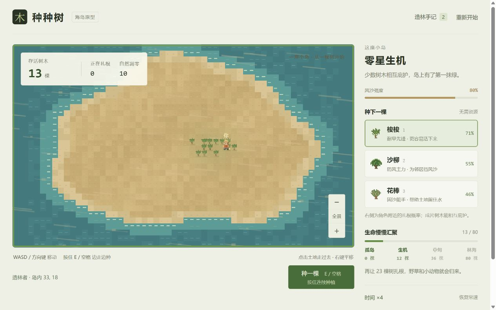

# DCTR

note for python and JavaScript

## 种种树 · 海岛造林 Demo

一个无需安装依赖的像素风网页游戏原型。控制造林者在一座荒芜海岛上种树，随着存活树木积累，风沙逐渐减弱，草地、动物和溪流自动出现。

### 试玩

直接用浏览器打开 [demo/dist/index.html](demo/dist/index.html)，无需联网。

也可以使用 Node.js 启动本地预览：

```sh
cd demo
node serve.cjs
```

访问终端输出的 `http://127.0.0.1:5180/`。

### 操作

- **WASD / 方向键**：移动角色；也可以点击岛上土地让角色走过去。
- **E / 空格**：在角色身边种树，按住可边走边种。
- **1 / 2 / 3**：切换梭梭、沙柳、花棒。
- **右键拖动 / 滚轮**：平移地图 / 缩放。
- 手机可使用方向按钮和种树按钮。

海岸限定地图边界。树苗会存活或枯死，不同树种的生态贡献不同；草地、水源和动物由生态进度自动生成。试玩版在存活 12、36、80 棵时推进阶段，结局后仍可继续种树。本轮进度在刷新后清空。

### 检查

```sh
node demo/check.cjs
```

检查海岸边界、角色移动与近身种植、树苗存活和自然损耗、树种差异及生态阶段。



更多说明见 [demo/README.md](demo/README.md)。
